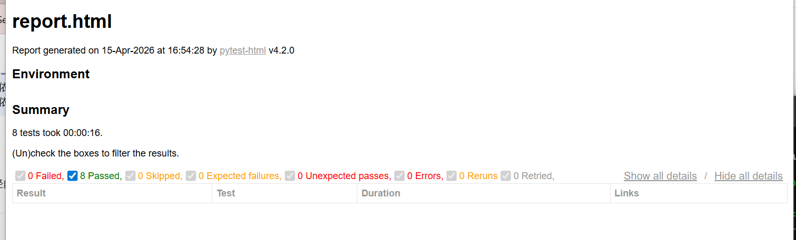

\# GitHub API 接口自动化测试框架


\## 项目简介

基于 Python + Pytest + Requests 的 GitHub REST API 自动化测试框架，覆盖用户管理、仓库操作等核心业务场景。


\## 技术栈

\- \*\*语言\*\*：Python 3.12

\- \*\*测试框架\*\*：Pytest

\- \*\*请求库\*\*：Requests

\- \*\*报告\*\*：Allure / pytest-html

\- \*\*CI/CD\*\*：GitHub Actions


\## 项目结构

github\_api\_test/

├── api/

│ ├── \_\_init\_\_.py

│ └── github\_api.py

├── config/

│ ├── \_\_init\_\_.py

│ └── config.py

├── testcases/

│ ├── \_\_init\_\_.py

│ ├── conftest.py

│ └── test\_github\_api.py

├── utils/

│ └── \_\_init\_\_.py

├── pytest.ini

├── requirements.txt

└── README.md


text


\## 快速开始


\### 1. 克隆项目

```bash

git clone https://github.com/Meiiiihe/github\_api\_test.git

cd github\_api\_test

## 📊 测试报告



### 测试结果
- ✅ 8/8 测试用例通过
- ✅ 通过率 100%
